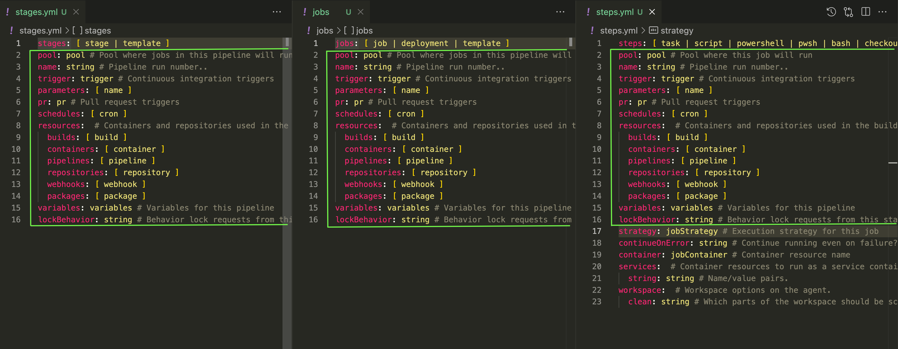

# azure-devops-ci-cd-demo

Sign up or sign in from [Azure DevOps Portal](https://aka.ms/SignupAzureDevOps)
## Azure DevOps YAML Pipeline

**A stage is one or more jobs and stages are the major divisions in a pipeline**

**A job is a linear series of steps.**

**Steps can be tasks, scripts, or references to external templates.**

Find more details from [Azure YAML schema reference](https://docs.microsoft.com/en-us/azure/devops/pipelines/yaml-schema/?view=azure-pipelines)

## Hierarch of YAML

- Pipeline
    - Stage A
        - Job 1
            - Step 1.1
            - Step 1.2
            - Step 1.3
            - ...
        - Job 2
            - Step 2.1
            - Step 2.2
            - ...
    - Stage B
        - Job 3
            - Step 3.1
            - Step 3.2
            - Step 3.3
            - Step 3.4
            - ...
        - Job 4
            - Step 4.1
            - Step 4.2
            - Step 4.3
            - Step 4.4
            - Step 4.5
            - Step 4.6
            - ...
    - Stage C
        - Job 5
            - Step 5.1
            - Step 5.2
            - ...
        - Job 6
            - Step 6.1
            - Step 6.2
            - ...

Simple pipelines don't require all of these levels.

If you have a **single-stage**, you can omit the **stages** keyword and directly specify the **jobs** keyword:

In a **single-job** build you can omit **stages** and **jobs** because there are only steps.

## Stages Definition
Find more details for [properties](https://docs.microsoft.com/en-us/azure/devops/pipelines/yaml-schema/pipeline?view=azure-pipelines#properties-12)

```yaml
stages: [ stage | template ]
pool: pool # Pool where jobs in this pipeline will run unless otherwise specified
name: string # Pipeline run number.. 
trigger: trigger # Continuous integration triggers
parameters: [ name ]
pr: pr # Pull request triggers
schedules: [ cron ]
resources:  # Containers and repositories used in the build
  builds: [ build ]
  containers: [ container ]
  pipelines: [ pipeline ]
  repositories: [ repository ]
  webhooks: [ webhook ]
  packages: [ package ]
variables: variables # Variables for this pipeline
lockBehavior: string # Behavior lock requests from this stage should exhibit in relation to other exclusive lock requests.  (runLatest,sequential)
```

## Jobs Definition
Find more details for [properties](https://docs.microsoft.com/en-us/azure/devops/pipelines/yaml-schema/pipeline?view=azure-pipelines#properties-4)

```yaml
jobs: [ job | deployment | template ]
pool: pool # Pool where jobs in this pipeline will run unless otherwise specified
name: string # Pipeline run number.. 
trigger: trigger # Continuous integration triggers
parameters: [ name ]
pr: pr # Pull request triggers
schedules: [ cron ]
resources:  # Containers and repositories used in the build
  builds: [ build ]
  containers: [ container ]
  pipelines: [ pipeline ]
  repositories: [ repository ]
  webhooks: [ webhook ]
  packages: [ package ]
variables: variables # Variables for this pipeline
lockBehavior: string # Behavior lock requests from this stage should exhibit in relation to other exclusive lock requests.  (runLatest,sequential)
```

## Steps Definiton
Find more details for [properties](https://docs.microsoft.com/en-us/azure/devops/pipelines/yaml-schema/pipeline?view=azure-pipelines#properties-9)

```yaml
steps: [ task | script | powershell | pwsh | bash | checkout | download | downloadBuild | getPackage | publish | template | restoreCache | saveCache | reviewApp ]
pool: pool # Pool where jobs in this pipeline will run unless otherwise specified
name: string # Pipeline run number.. 
trigger: trigger # Continuous integration triggers
parameters: [ name ]
pr: pr # Pull request triggers
schedules: [ cron ]
resources:  # Containers and repositories used in the build
  builds: [ build ]
  containers: [ container ]
  pipelines: [ pipeline ]
  repositories: [ repository ]
  webhooks: [ webhook ]
  packages: [ package ]
variables: variables # Variables for this pipeline
lockBehavior: string # Behavior lock requests from this stage should exhibit in relation to other exclusive lock requests.  (runLatest,sequential)
strategy: jobStrategy # Execution strategy for this job
continueOnError: string # Continue running even on failure?. 
container: jobContainer # Container resource name
services:  # Container resources to run as a service container.
  string: string # Name/value pairs.
workspace:  # Workspace options on the agent.
  clean: string # Which parts of the workspace should be scorched before fetching.  (outputs, resources, all)
```
## Shared Properties in YAML
Notice that 15 properties are shared in **stages**, **jobs** and **steps**. Because, even we don't have **stages** explicitly in YAML file, one **stage** will be created implicitly. In addition to this, if we don't have **jobs** as well, then one **stage** and one **job** will be created implicitly.

