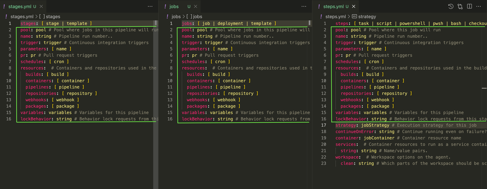
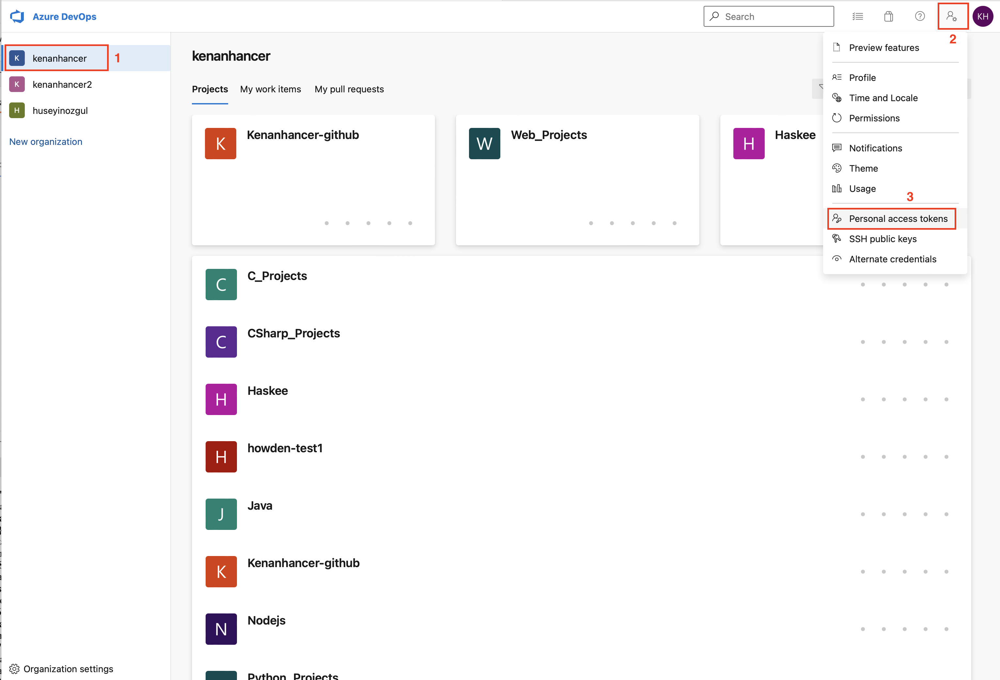
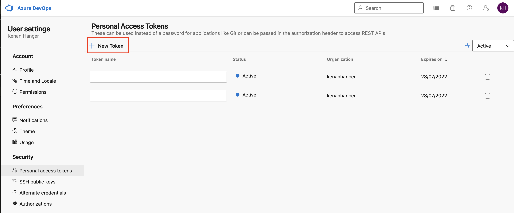
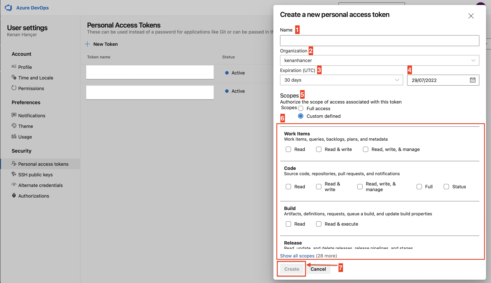
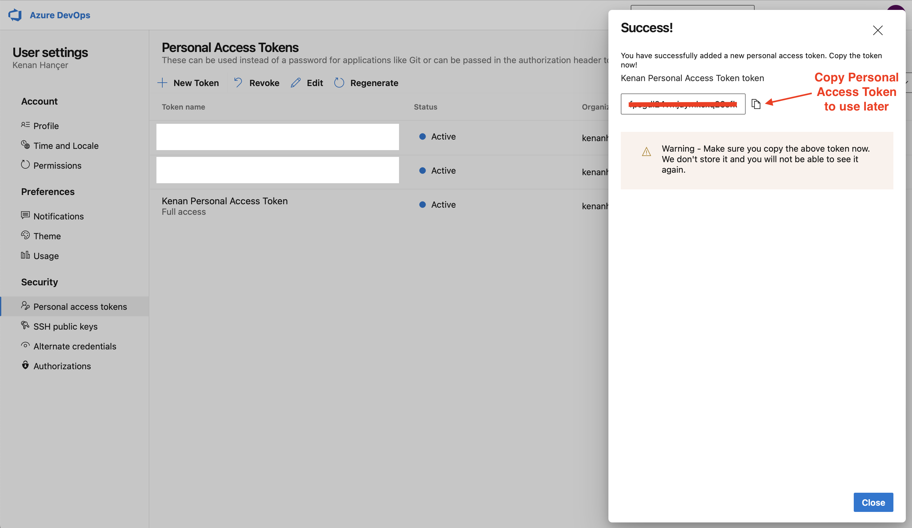

# azure-devops-ci-cd-demo

Sign up or sign in from [Azure DevOps Portal](https://aka.ms/SignupAzureDevOps)
## Azure DevOps YAML Pipeline

**A stage is one or more jobs and stages are the major divisions in a pipeline**

**A job is a linear series of steps.**

**Steps can be tasks, scripts, or references to external templates.**

Find more details from [Azure YAML schema reference](https://docs.microsoft.com/en-us/azure/devops/pipelines/yaml-schema/?view=azure-pipelines)

## Hierarch of YAML

- Pipeline
    - Stage A
        - Job 1
            - Step 1.1
            - Step 1.2
            - Step 1.3
            - ...
        - Job 2
            - Step 2.1
            - Step 2.2
            - ...
    - Stage B
        - Job 3
            - Step 3.1
            - Step 3.2
            - Step 3.3
            - Step 3.4
            - ...
        - Job 4
            - Step 4.1
            - Step 4.2
            - Step 4.3
            - Step 4.4
            - Step 4.5
            - Step 4.6
            - ...
    - Stage C
        - Job 5
            - Step 5.1
            - Step 5.2
            - ...
        - Job 6
            - Step 6.1
            - Step 6.2
            - ...

Simple pipelines don't require all of these levels.

If you have a **single-stage**, you can omit the **stages** keyword and directly specify the **jobs** keyword:

In a **single-job** build you can omit **stages** and **jobs** because there are only steps.

## Stages Definition
Find more details for [properties](https://docs.microsoft.com/en-us/azure/devops/pipelines/yaml-schema/pipeline?view=azure-pipelines#properties-12)

```yaml
stages: [ stage | template ]
pool: pool # Pool where jobs in this pipeline will run unless otherwise specified
name: string # Pipeline run number.. 
trigger: trigger # Continuous integration triggers
parameters: [ name ]
pr: pr # Pull request triggers
schedules: [ cron ]
resources:  # Containers and repositories used in the build
  builds: [ build ]
  containers: [ container ]
  pipelines: [ pipeline ]
  repositories: [ repository ]
  webhooks: [ webhook ]
  packages: [ package ]
variables: variables # Variables for this pipeline
lockBehavior: string # Behavior lock requests from this stage should exhibit in relation to other exclusive lock requests.  (runLatest,sequential)
```

## Stage Definition
Stages are a collection of related jobs. By default, stages run sequentially. Each stage starts only after the preceding stage is complete unless otherwise specified via the dependsOn property.

Find more details for [properties](https://docs.microsoft.com/en-us/azure/devops/pipelines/yaml-schema/stages-stage?view=azure-pipelines#properties-2)

```yaml
stages:
- stage: string # Required as first property. ID of the stage. 
  displayName: string # Human-readable name for the stage. 
  pool: pool # Pool where jobs in this stage will run unless otherwise specified
  dependsOn: string | [ string ]  # Any stages which must complete before this one
  condition: string # Evaluate this condition expression to determine whether to run this stage. 
  variables: variables # Stage-specific variables
  jobs: [ job | deployment | template ]
  lockBehavior: string # Behavior lock requests from this stage should exhibit in relation to other exclusive lock requests.  (runLatest,sequential)
  templateContext:  # Stage related information passed from a pipeline when extending a template. See remarks for more information.
```

## Jobs Definition
Find more details for [properties](https://docs.microsoft.com/en-us/azure/devops/pipelines/yaml-schema/pipeline?view=azure-pipelines#properties-4)

```yaml
jobs: [ job | deployment | template ]
pool: pool # Pool where jobs in this pipeline will run unless otherwise specified
name: string # Pipeline run number.. 
trigger: trigger # Continuous integration triggers
parameters: [ name ]
pr: pr # Pull request triggers
schedules: [ cron ]
resources:  # Containers and repositories used in the build
  builds: [ build ]
  containers: [ container ]
  pipelines: [ pipeline ]
  repositories: [ repository ]
  webhooks: [ webhook ]
  packages: [ package ]
variables: variables # Variables for this pipeline
lockBehavior: string # Behavior lock requests from this stage should exhibit in relation to other exclusive lock requests.  (runLatest,sequential)
```

## Job Definition
Find more details for [properties](https://docs.microsoft.com/en-us/azure/devops/pipelines/yaml-schema/jobs-job?view=azure-pipelines#properties-4)

```yaml
jobs:
- job: string # Required as first property. ID of the job. Valid names may only contain alphanumeric characters and '_' and may not start with a number.
  displayName: string # Human-readable name for the job. 
  dependsOn: string | [ string ]  # Any jobs which must complete before this one
  condition: string # Evaluate this condition expression to determine whether to run this job. 
  continueOnError: string # Continue running even on failure?. 
  timeoutInMinutes: string # Time to wait for this job to complete before the server kills it. 
  cancelTimeoutInMinutes: string # Time to wait for the job to cancel before forcibly terminating it. 
  variables: variables # Job-specific variables
  strategy: jobStrategy # Execution strategy for this job
  pool: pool # Pool where this job will run
  container: jobContainer # Container resource name
  services:  # Container resources to run as a service container.
    string: string # Name/value pairs.
  workspace:  # Workspace options on the agent.
    clean: string # Which parts of the workspace should be scorched before fetching.  (outputs, resources, all)
  uses:  # Any resources required by this job that are not already referenced
    repositories: [ string ] # Repository references 
    pools: [ string ] # Pool references 
  steps: [ task | script | powershell | pwsh | bash | checkout | download | downloadBuild | getPackage | publish | template | restoreCache | saveCache | reviewApp ]
  templateContext:  # Job related information passed from a pipeline when extending a template. See remarks for more information.
```

## Steps Definiton
Find more details for [properties](https://docs.microsoft.com/en-us/azure/devops/pipelines/yaml-schema/pipeline?view=azure-pipelines#properties-9)

```yaml
steps: [ task | script | powershell | pwsh | bash | checkout | download | downloadBuild | getPackage | publish | template | restoreCache | saveCache | reviewApp ]
pool: pool # Pool where jobs in this pipeline will run unless otherwise specified
name: string # Pipeline run number.. 
trigger: trigger # Continuous integration triggers
parameters: [ name ]
pr: pr # Pull request triggers
schedules: [ cron ]
resources:  # Containers and repositories used in the build
  builds: [ build ]
  containers: [ container ]
  pipelines: [ pipeline ]
  repositories: [ repository ]
  webhooks: [ webhook ]
  packages: [ package ]
variables: variables # Variables for this pipeline
lockBehavior: string # Behavior lock requests from this stage should exhibit in relation to other exclusive lock requests.  (runLatest,sequential)
strategy: jobStrategy # Execution strategy for this job
continueOnError: string # Continue running even on failure?. 
container: jobContainer # Container resource name
services:  # Container resources to run as a service container.
  string: string # Name/value pairs.
workspace:  # Workspace options on the agent.
  clean: string # Which parts of the workspace should be scorched before fetching.  (outputs, resources, all)
```

## Step types

Find more details for [Step types](https://docs.microsoft.com/en-us/azure/devops/pipelines/yaml-schema/steps?view=azure-pipelines#list-types-4)


## Shared Properties in YAML
Notice that 15 properties are shared in **stages**, **jobs** and **steps**. Because, even we don't have **stages** explicitly in YAML file, one **stage** will be created implicitly. In addition to this, if we don't have **jobs** as well, then one **stage** and one **job** will be created implicitly.



## Create Personal Access Token(PAT) in Azure DevOps Portal

Sign in to your organisation (https://dev.azure.com/{yourorganization})

Select Organization from Azure DevOps Portal firstly, then create Personal Access Token for it.






## Test your Personal Access Token(PAT)
find more details about Azure DevOps in [Projects REST API](https://docs.microsoft.com/en-us/rest/api/azure/devops/core/projects/list?view=azure-devops-rest-6.0)

I will call Azure DevOps REST API to test so that i called the following url to list all the projects under your organization.

https://dev.azure.com/<your_organization_name>/_apis/projects?api-version=6.0

find more details in [creating Personal Access Token](https://kenanhancer.com/2022/06/29/azure-devops-creating-personal-access-token-pat/)
### First way
username is not necessary when you use Personal Access Token(PAT) but don't forget to use **:** sign before Personal Access Token(PAT).
```bash
curl -u <your_user_name>:<your_personal_access_token> 'https://dev.azure.com/<your_organization_name>/_apis/projects?api-version=6.0'
```

### Second way
```bash
TOKEN=$(echo -n "<your_user_name>:<your_personal_access_token>" | base64)

curl --header "Authorization: Basic $TOKEN" 'https://dev.azure.com/<your_organization_name>/_apis/projects?api-version=6.0'
```

### Third way
```bash
echo -n "<your_user_name>:<your_personal_access_token>" | base64 | read TOKEN; curl --header "Authorization: Basic $TOKEN" 'https://dev.azure.com/<your_organization_name>/_apis/projects?api-version=6.0'
```

## Azure DevOps REST API

When we need to create, retrieve, update or delete access to the Azure DevOps services's resources, we can use Azure DevOps REST API.

Find more Azure DevOps REST services in [https://docs.microsoft.com/en-us/rest/api/azure/devops/?view=azure-devops-rest-7.1]([https://docs.microsoft.com/en-us/rest/api/azure/devops/?view=azure-devops-rest-7.1)

### List processes in your organization
```bash
echo -n "Organization: " && read ORGANIZATION

echo -n "PAT: " && read PAT

curl --silent --user :$PAT \
--request GET "https://dev.azure.com/$ORGANIZATION/_apis/process/processes?api-version=6.0" | jq -r .
```

### Get process id in your organization
```bash
ORGANIZATION=$1

PROCESS_NAME=$2

PAT=$3

curl --silent --user :$PAT \
--request GET "https://dev.azure.com/$ORGANIZATION/_apis/process/processes?api-version=6.0" | jq -r '.value[] | select(.name=="'$PROCESS_NAME'") | .id'
```

### Get process in your organization
```bash
echo -n "Organization: " && read ORGANIZATION

echo -n "Process Name: " && read PROCESS_NAME

echo -n "PAT: " && read PAT

PROCESS_ID=$(. ./getProcessId.sh $ORGANIZATION $PROCESS_NAME $PAT)

curl --silent --user :$PAT \
--request GET "https://dev.azure.com/$ORGANIZATION/_apis/process/processes/$PROCESS_ID?api-version=6.0" | jq -r .
```

### List projects in your organization
```bash
echo -n "Organization: " && read ORGANIZATION

echo -n "PAT: " && read PAT

curl --silent --user :$PAT \
--request GET "https://dev.azure.com/$ORGANIZATION/_apis/projects?api-version=6.0" | jq -r .
```

### Get project id in your organization
```bash
ORGANIZATION=$1

PROJECT_NAME=$2

PAT=$3

PROJECT_ID=$(curl --silent --user :$PAT \
--request GET "https://dev.azure.com/$ORGANIZATION/_apis/projects?api-version=6.0" | jq -r '.value[] | select(.name=="'$PROJECT_NAME'") | .id')

echo "$PROJECT_ID"
```

### Get project in your organization
```bash
echo -n "Organization: " && read ORGANIZATION

echo -n "Project Name: " && read PROJECT_NAME

echo -n "PAT: " && read PAT

PROJECT_ID=$(. ./getProjectId.sh $ORGANIZATION $PROJECT_NAME $PAT)

curl --silent --user :$PAT \
--request GET "https://dev.azure.com/$ORGANIZATION/_apis/projects/$PROJECT_ID?api-version=6.0" | jq -r .
```

### Get project properties in your organization
```bash
echo -n "Organization: " && read ORGANIZATION

echo -n "Project Name: " && read PROJECT_NAME

echo -n "PAT: " && read PAT

PROJECT_ID=$(. ./getProjectId.sh $ORGANIZATION $PROJECT_NAME $PAT)

curl --silent --user :$PAT \
--request GET "https://dev.azure.com/$ORGANIZATION/_apis/projects/$PROJECT_ID/properties?api-version=6.0-preview.1" | jq -r .
```

### Delete project in your organization
```bash
echo -n "Organization: " && read ORGANIZATION

echo -n "ProjectID: " && read PROJECT_ID

echo -n "PAT: " && read PAT

curl --silent --user :$PAT \
--request DELETE "https://dev.azure.com/$ORGANIZATION/_apis/projects/$PROJECT_ID?api-version=6.0" | jq -r .
```

### Create project in your organization
```bash
echo -n "Organization: " && read ORGANIZATION

echo -n "Project Name: " && read PROJECT_NAME

echo -n "PAT: " && read PAT

curl --silent --user :$PAT \
--request POST "https://dev.azure.com/$ORGANIZATION/_apis/projects?api-version=6.0" \
--header 'Content-Type: application/json' \
--data-raw '{
    "name": "'"$PROJECT_NAME"'",
    "description": "Frabrikam travel app for Windows Phone",
    "visibility": "private",
    "capabilities": {
        "versioncontrol": {
            "sourceControlType": "Git"
        },
        "processTemplate": {
            "templateTypeId": "adcc42ab-9882-485e-a3ed-7678f01f66bc"
        }
    }
}' | jq -r .
```

### List pipelines in your organization
```bash
echo -n "Organization: " && read ORGANIZATION

echo -n "Project Id or Project Name: " && read PROJECT_ID_NAME

echo -n "PAT: " && read PAT

curl --silent --user :$PAT \
--request GET "https://dev.azure.com/$ORGANIZATION/$PROJECT_ID_NAME/_apis/pipelines?api-version=7.1-preview.1" | jq -r .
```